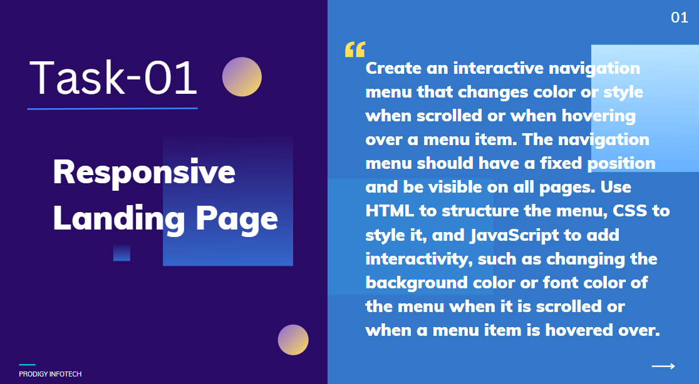

# Task 1: Responsive Landing Page

🚀 **Internship**: Web Development @ Prodigy InfoTech  
📁 **Task**: Build a responsive landing page with an interactive navigation menu

## 🖼️ Task Screenshot

## 🛠️ Technologies Used:
- HTML
- CSS
- JavaScript

## 📄 Description:
Created a navigation menu that changes style on scroll and hover using JavaScript.

## 🔗 GitHub Repository:
[https://github.com/Prayoswini/PRODIGY_WD_01](https://github.com/Prayoswini/PRODIGY_WD_01)
